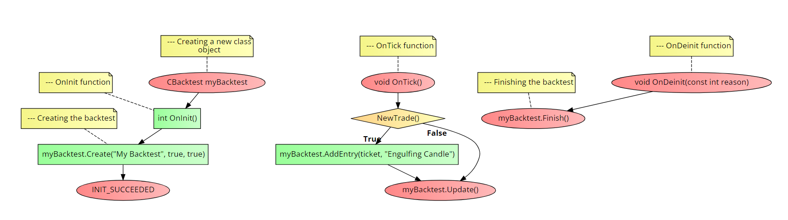

# CBacktest class
This class will help you to manage backtesting reports <br>

### Table of Contents
- [CBacktest class](#cbacktest-class)
    - [Table of Contents](#table-of-contents)
  - [Files that it generates](#files-that-it-generates)
    - [Notes](#notes)
- [Installation](#installation)
    - [Notes](#notes-1)
- [Usage](#usage)
  - [AddEntry()](#addentry)
  - [Update()](#update)
    - [Notes](#notes-2)
  - [Finish()](#finish)
  - [Setters](#setters)
  - [Getters](#getters)
- [Example](#example)
- [Errors](#errors)

## Files that it generates
- **BacktestReport.csv** - This will have all the entries of the backtest
- **EntriesDetails.md** - This will have all the details of the entries in the markdown format, this includes the trade parameters, a comment for the entry, and a screenshot of the entry the chart.
- **Chart Images** - This folder will have all the images of the entries in the backtest

### Notes
- This class is not meant to be used as live trading journal, however it does work as a live trading journal, but it is not recommended to use it as a live trading journal.

# Installation
1. **You need to call the framework in the beginning of your script, see the main [README](../README.md) file for more information.**
2. Make a new `class object` of the `CBacktest` class or use the pre-defined `Backtest` object using the following code:
```cpp
// For the pre-defined object
Backtest.Create(string name,                    //The name of the backtest
                bool makeDetailedReport = true, //If you want to make a detailed report in md format
                bool deleteOldFiles = true,     //If you want to delete the old files on the next backtest, this must be false in order to use it as a live trading journal
                );

// For a new class object
CBacktest myBacktest;

myBacktest.Create(string name,                    //The name of the backtest
                bool makeDetailedReport = true, //If you want to make a detailed report in md format
                bool deleteOldFiles = true,     //If you want to delete the old files on the next backtest, this must be false in order to use it as a live trading journal
                );
```

**return value:** `bool` - `true` if the backtest was created successfully, `false` if it failed.

### Notes
Do not use the `Backtest` object if you are using a new `CBacktest` class object, and vice versa.

# Usage
## AddEntry()
This method will add an entry to the backtest report, it will also add a screenshot of the entry to the `Chart Images` folder.

It does have 2 versions of the method, one gets the data automatically from the trade using the `ticket` parameter, and the other one gets the data from the parameters.

```cpp
//Automatic
AddEntry(long ticket,               //The ticket of the entry
         string strategy,           //The strategy used
         bool takeScreenshot = true //If you want to take a screenshot of the entry
         int timeframe = PERIOD_CURRENT //The timeframe of the chart screenshot
         );

//Manual
AddEntry(string strategy,           //The strategy used
         string symbol,             //The symbol
         double entryPrice,         //The entry price
         double stopLoss,           //The stop loss
         double takeProfit,         //The take profit
         double volume,             //The volume
         ENUM_ORDER_TYPE orderType, //The order type
         string comment,            //The comment
         bool takeScreenshot = true //If you want to take a screenshot of the entry
         int timeframe = PERIOD_CURRENT //The timeframe of the chart screenshot
         );
```

**Return value:** `bool` - `true` if the entry was added successfully, `false` if it failed.

## Update()
This method will be looking for trade updates and add it to the backtest report on an automated way.

```cpp
Update(void);   //Update the backtest report
```

**Return value:** `void` - Does not return anything.

### Notes
This method must be called in the `OnTick()` function of the script if you used the `automated` entry method. Hoewever, if you add your parameters manuallty, do not call this method in order to save resources.

## Finish()
This method will add the final code lines to the files in order to make them readable.

```cpp
Finish(void);   //Add the final touches to the files, call it at the end of the script
```

**Return value:** `void` - Does not return anything.

## Setters
- `SetPartialTicket(long ticket)` - Set the ticket of the partials entry in case it changed.

## Getters
- `string GetFileName()` - Get the name of the backtest `csv` file.
- `string GetReportName()` - Get the name of the backtest `.md` report file.
- `long GetTicket()` - Get the ticket of the main entry.
- `long GetPartialTicket()` - Get the ticket of the partials trade left.

# Example
The following code is an example of how to use the `CBacktest` class. It will do the following actions:
1. Create a new backtest and initialize it using a new `CBacktest` class object.
2. Will open a position after and engulfing candle if there's not other positions opened.
3. Will add the entry to the backtest report using the automated mode.
4. Will deinitialize the backtest report.
   
```cpp
//+------------------------------------------------------------------+
//| Example program for the CBacktest class                          |
//+------------------------------------------------------------------+
//--- Importing the framework
#include <Just_MQL_Framework/main.mqh>

//--- Creating a new class object
CBacktest myBacktest;

//--- Creating an object for the engulfing candle
CTicks ticks;

//--- OnInit function
int OnInit()
{
    //--- Creating the backtest
    myBacktest.Create("My Backtest", true, true);

    ticks.Create(Symbol(), PERIOD_CURRENT);

    return (INIT_SUCCEEDED);
}

//--- OnTick function
void OnTick()
{
    //--- Checking for opened positions
    if(Trading.TradesTotal() == 0)
    {
        //--- Busllish engulfing candle
        if(IsEngulfed() == "Bullish")
        {
            //--- Opening the trade
            Trading.Buy(0.01);

            //--- Getting the ticket of the trade
            long ticket = Trading.ResultTicket();

            //--- Adding the entry to the backtest report
            myBacktest.AddEntry(ticket, "Engulfing Candle");
        }

        //--- Bearish engulfing candle
        else if(IsEngulfed() == "Bearish")
        {
            //--- Opening the trade
            Trading.Sell(0.01);

            //--- Getting the ticket of the trade
            long ticket = Trading.ResultTicket();

            //--- Adding the entry to the backtest report
            myBacktest.AddEntry(ticket, "Engulfing Candle");
        }

        else
        {
            //--- Update the backtest report if there is a trade opened
            myBacktest.Update();
            return;
        }
        
    }

    //--- An open position was found
    else
    {
        //--- Update the backtest report if there's not trades opened
        myBacktest.Update();
        return;
    }
}

//--- OnDeinit function
void OnDeinit(const int reason)
{
    //--- Finishing the backtest
    myBacktest.Finish();
}

string IsEngulfed()
{
    //--- For bullish pattern
    if(ticks.Close(1) > ticks.Open(1) && ticks.Close(2) < ticks.Open(2))
    {
        if(ticks.Close(1) > ticks.Open(2))
        {
            return ("Bullish");
        }
    }
    else if(ticks.Close(1) < ticks.Open(1) && ticks.Close(2) > ticks.Open(2))
    {
        if(ticks.Close(1) < ticks.Open(2))
        {
            return ("Bearish");
        }
    }
    else
    {
        return ("");
    }

    return ("");
}
```

Check the flow-chart below to see a compact and visual undertanding on how to call the class methods:



# Errors
- `ERR_BACKTESTING_CREATE` - The backtest was not created successfully. This can be caused for an error reading the file, try using the 'GetLastError()' function to get the error code from MetaTrader.
- `ERR_CONSTRUCTOR_NOT_CALLED` - The constructor was not called before using the class methods. Call the constructor before using the class methods.
- `ERR_BACKTESTING_DATA_NOT_ADDED` - The data was not added to the backtest report successfully. This can be caused for an error reading the file or selecting the order from the pools, try using the 'GetLastError()' function to get the error code from MetaTrader.