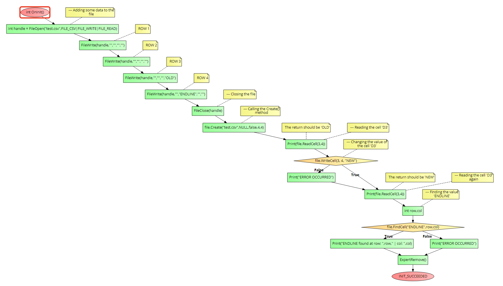

# CCSVFile class
This class will help you handle CSV files on a straightforward way <br>

## Highlighted Features
- Write data to a specific cell by its position.
- Read data from a specific cell by its position.

## Understanding CSV files
In order to avoid errors and unexpected results, please be sure to read. <br>
For using the methods that allow you to set and get data from a cell by its position you must know the number of columns and rows that the file does have. <br>
A failure to provide these parameters wrong will result in wrong data returned and unexpected errors. <br>
However, you can read data from the file without knowing these parameters, but you won't be able to use the methods that use cell coordinates to do so.

### How to get the columns and rows amount?

- You must count columns and rows from cell A1 to the last cell with `data != ""`, drawing a mental rectangle over the data. See the example below: <br>


<br>
Let's try another example:
<br>

In this example, we accidentally added a `value` to the cell `M72` which extended our rectangle, if we failed to provide `13 columns` and `72 rows`, then our requests will return the wrong data.

<br>


# Installation
1. **You need to call the framework in the beginning of your script, see the main [README](../README.md) file for more information.**
2. You must make a new `CCSVFile` class object.
3. You must call the `Create()` method of the class object.

```cpp
//--- Creating a new class object
CCSVFile myFile;

//--- Calling the Create() method
myFile.Create(
              string name, //The name of the file
              string path = NULL, //The path or folder, must end with a backslash
              bool commonFlag = false, //If true, the file will be created in the common folder
              int rows = -1, //The number of rows that the file does have
              int cols = -1 //The number of columns that the file does have
              );
```

# Usage
## Read()
It reads the whole file and returned it as a string.

```cpp
Read(string &returned[]);
```

**Return value:** `bool` - `true` if the file was read, `false` if there was an error.

## ReadCell()
It reads a specific cell of the file by its position.

```cpp
ReadCell(
      int row,    //The row of the cell 
      int col     //The column of the cell
      );
```

**Return value:** `string` - The cell value.

## WriteCell()
It writes data to a specific cell of the file by its position.

```cpp
WriteCell(
      int row,    //The row of the cell 
      int col,    //The column of the cell
      string toWrite  //The data to write
      );
```

**Return value:** `bool` - `true` if the data was written, `false` if there was an error.

## FindCell()
It finds a value in a cell and return the first found coordinates to the given variables.

```cpp
FindCell(
      string toFind,  //The value to find
      int &resRow,    //The row of the cell 
      int &resCol     //The column of the cell
      );
```

**Return value:** `bool` - `true` if the value was found, `false` if there was an error.

## Rename()
It renames the file.

```cpp
Rename(
      string newName  //The new name of the file
      );
```

**Return value:** `bool` - `true` if the file was renamed, `false` if there was an error.

## Delete()
It deletes the file.

```cpp
Delete();
```

**Return value:** `bool` - `true` if the file was deleted, `false` if there was an error.

## Move()
It moves the file to another folder.

```cpp
Move(
      string newPath,  //The new path of the file
      bool deleteFolder = false  //If true, the folder will be deleted
      );
```

**Return value:** `bool` - `true` if the file was moved, `false` if there was an error.

## Getters
- `GetFileName()` - Returns the name of the file.
- `GetFilePath()` - Returns the path of the file.
- `GetFileFullPath()` - Returns the full path of the file.`
- `GetFileExtension()` - Returns the extension of the file.
- `IsCommon()` - Returns `true` if the file is in the common folder, `false` if it's in the script folder.

# Example
The following code is an example of how to use the `CCSVFile` class. It will do the following actions:
1. It will make a new class object.
2. It will create a file and fill some cells with data.
3. It will call the `Create()` method of the class object.
4. It will read the cell `D3` and print it.
5. It will change the value of the cell `D3` to `NEW`.
6. It will read the cell `D3` again and print it.
7. It will find the value `ENDLINE` in the file and print the coordinates of the cell that contains it.

```cpp
//+------------------------------------------------------------------+
//| Example program for the CTextFile class                          |
//+------------------------------------------------------------------+
//--- Importing the framework
#include <Just_MQL_Framework/main.mqh>

//--- Creating a new class object
CCSVFile file;

int OnInit()
{
      //--- Adding some data to the file
      int handle = FileOpen("test.csv",FILE_CSV|FILE_WRITE|FILE_READ);

      FileWrite(handle,"","","","");  //ROW 1
      FileWrite(handle,"","","","");  //ROW 2
      FileWrite(handle,"","","","OLD");  //ROW 3
      FileWrite(handle,"","ENDLINE","","");  //ROW 4

      //--- Closing the file
      FileClose(handle);

      //--- Calling the Create() method
      file.Create("test.csv",NULL,false,4,4);

      //--- Reading the cell 'D3'
      Print(file.ReadCell(3,4));  //The return should be 'OLD'

      //--- Changing the value of the cell 'D3'
      if(!file.WriteCell(3, 4, "NEW"))
            Print("ERROR OCCURRED");
      
      //--- Reading the cell 'D3' again
      Print(file.ReadCell(3,4));  //The return should be 'NEW'

      //--- Finding the value 'ENDLINE'
      int row,col;
      if(file.FindCell("ENDLINE",row,col))
            Print("ENDLINE found at row: ",row," | col: ",col);
      else
            Print("ERROR OCCURRED");

      ExpertRemove();
      return(INIT_SUCCEEDED);
}
```

**Output:**


Check the flow-chart below to see a compact and visual undertanding on how to call the class methods:



# Errors
- `ERR_FILE_OPEN` - The file could not be opened.
- `ERR_WRONG_PARAMETERS` - The parameters given to the class methods are wrong. Check the parameters given to the class methods.
- `ERR_CONSTRUCTOR_NOT_CALLED` - The constructor was not called before using the class methods. Call the constructor before using the class methods.