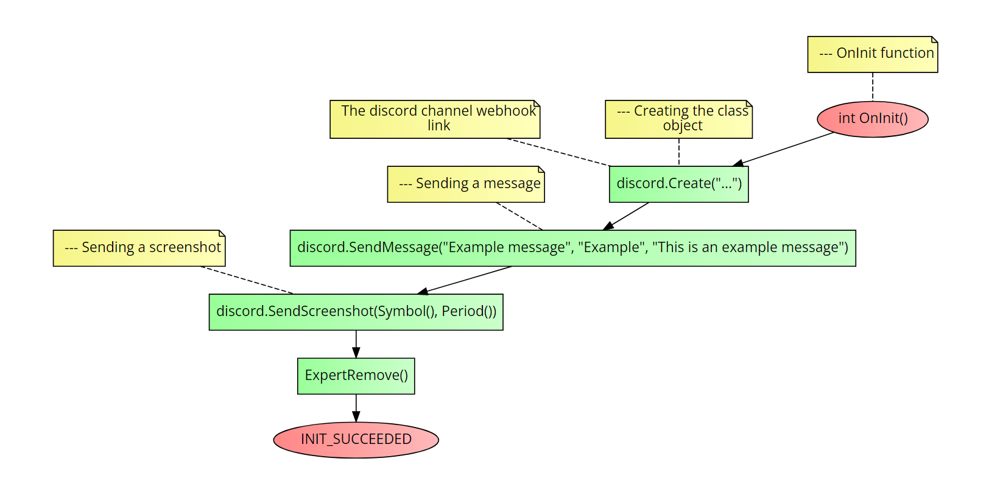

# Class CDiscord
This class will help sending messages and chart screenshots to discord <br>

### Table of Contents
- [Class CDiscord](#class-cdiscord)
    - [Table of Contents](#table-of-contents)
- [Installation](#installation)
- [Usage](#usage)
  - [SendMessage()](#sendmessage)
  - [SendScreenshot()](#sendscreenshot)
    - [Notes](#notes)
- [Example](#example)
- [Errors](#errors)


# Installation
1. **You need to call the framework in the beginning of your script, see the main [README](../README.md) file for more information.**
2. You must create a new class object of `CDiscord` class.
3. You must call the `Create()` function of the class object.
4. You must add `https://discord.com` to the `AllowURL` in yoour MetaTrader settings.

```cpp
Create(string webhook); //The discord channel webhook link
```

# Usage
## SendMessage()
It sends a message to discord in an `embed` format.

```cpp
SendMessage(
            string msgName,     //The name of the message (outside the embed)
            string msgTitle,    //The embed title
            string message      //The embed body
);
```

**Return value:** `void`.

## SendScreenshot()
It sends a screenshot of the chart to discord.

```cpp
SendScreenshot(
            string symbol,      //The symbol of the chart
            int _period,        //The period of the chart (ex: 1 for M1)
            int screenWidth = 1920, //The width of the screenshot
            int screenHeight = 1080 //The height of the screenshot
);
```

**Return value:** `void`.

### Notes
The chart in which screenshot will be taken must be active.

# Example
The following code is an example of how to use the `CDiscord` class. It will do the following actions:
1. It will create a new class object of `CDiscord` class.
2. It will call the `Create()` function of the class object.
3. It will add a message to discord.
4. It will send a screenshot of the chart to discord.

```cpp
//+------------------------------------------------------------------+
//| Example program for the CDiscord class                           |
//+------------------------------------------------------------------+
//--- Importing the framework
#include <Just_MQL_Framework/main.mqh>

//--- New class object
CDiscord discord;

//--- OnInit function
int OnInit()
{
    //--- Creating the class object
    discord.Create("..."); //The discord channel webhook link

    //--- Sending a message
    discord.SendMessage("Example message", "Example", "This is an example message");

    //--- Sending a screenshot
    discord.SendScreenshot(Symbol(), Period());

    ExpertRemove();
    return(INIT_SUCCEEDED);
}
```

Check the flow-chart below to see a compact and visual undertanding on how to call the class methods:



# Errors
The class doesn't throw any errors. However, if you see that the message or screenshot is not being sent, check the following:
1. Check if the `webhook` is correct.
2. Check if the `discord URL` is added to the `AllowURL` in yoour MetaTrader settings.
3. Try calling the `GetLastError()` function as a `Print()` parameter to see if Metatrader is throwing any errors.

If none of that worked, please open an `issue` and we will re-create it for your.