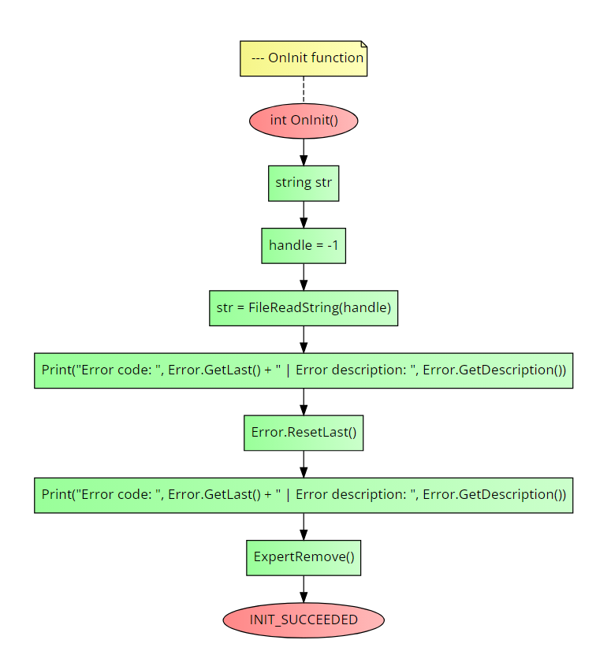

# CError class
This class will handle the errors of MQL and framework <br>

### Table of Contents
- [CError class](#cerror-class)
    - [Table of Contents](#table-of-contents)
- [Installation](#installation)
    - [Notes](#notes)
- [Usage](#usage)
  - [ResetLast()](#resetlast)
  - [GetLast()](#getlast)
  - [GetDescription()](#getdescription)
- [Example](#example)


# Installation
1. **You need to call the framework in the beginning of your script, see the main [README](../README.md) file for more information.**

### Notes
You can create a new `CError` class object but is not worth it. <br>

# Usage
## ResetLast()
It resets the last error of MetaTrader.

**Return value:** `void`.

## GetLast()
It returns the last error of MetaTrader.

**Return value:** `int` - The last error of MetaTrader.

## GetDescription()
It returns the description of the last error of MetaTrader.

**Return value:** `string` - The description of the last error of MetaTrader.

# Example
The following code is an example of how to use the `CError` class. It will do the following actions:
1. It will try reading a file that does not exist.
2. It will print the error code and its description.
3. It will reset the last error.
4. It will read again the last error and print it.

```cpp
//+------------------------------------------------------------------+
//| Example program for the CError class                             |
//+------------------------------------------------------------------+
//--- Importing the framework
#include <Just_MQL_Framework/main.mqh>

//--- OnInit function
int OnInit()
{
    string str;
    handle = -1;

    str = FileReadString(handle);

    Print("Error code: ", Error.GetLast() + " | Error description: ", Error.GetDescription());

    Error.ResetLast();

    Print("Error code: ", Error.GetLast() + " | Error description: ", Error.GetDescription());

    ExpertRemove();
    return (INIT_SUCCEEDED);
}
```

Check the flow-chart below to see a compact and visual undertanding on how to call the class methods:

