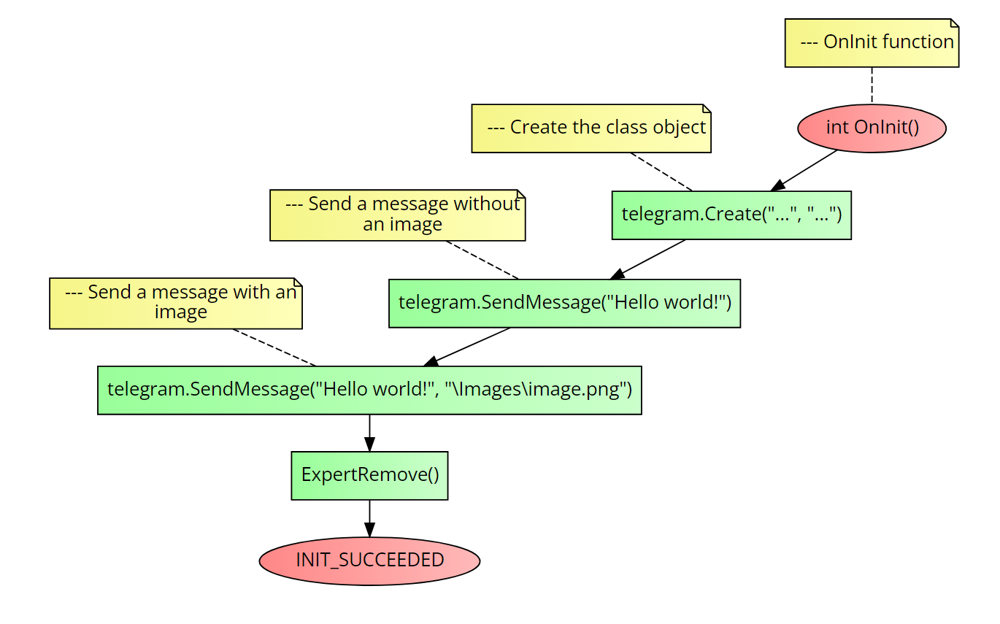

# Class CTelegram
This class will help sending messages and chart screenshots to discord <br>

### Table of Contents
- [Class CTelegram](#class-ctelegram)
    - [Table of Contents](#table-of-contents)
- [Installation](#installation)
- [Usage](#usage)
  - [SendMessage()](#sendmessage)
- [Example](#example)
- [Errors](#errors)


# Installation
1. **You need to call the framework in the beginning of your script, see the main [README](../README.md) file for more information.**
2. You must create a new class object of `CTelegram` class.
3. You must call the `Create()` function of the class object.
4. You must add `https://api.telegram.org` to the `AllowURL` in yoour MetaTrader settings.

```cpp
Create(string telegramToken,    //The telegram bot token
        string chatId           //The telegram chat id
        );
```

# Usage
## SendMessage()
It sends a message to a telegram chat and an image if you want.

```cpp
SendMessage(
            string message,     //The message
            string image = ""   //The image path
);
```

**Return value:** `bool`.

# Example
The following code is an example of how to use the `CTelegram` class. It will do the following actions:
1. It will create a new class object of `CTelegram` class.
2. It will call the `Create()` function of the class object.
3. It will add a message without an image.
4. It will send a message and an image.

```cpp
//+------------------------------------------------------------------+
//| Example program for the CTelegram class                          |
//+------------------------------------------------------------------+
//--- Importing the framework
#include <Just_MQL_Framework/main.mqh>

//--- New class object
CTelegram telegram;

//--- OnInit function
int OnInit()
{
    //--- Create the class object
    telegram.Create("...", "...");

    //--- Send a message without an image
    telegram.SendMessage("Hello world!");

    //--- Send a message with an image
    telegram.SendMessage("Hello world!", "\\Images\\image.png");

    ExpertRemove();
    return(INIT_SUCCEEDED);
}
```

Check the flow-chart below to see a compact and visual undertanding on how to call the class methods:



# Errors
The class doesn't throw any errors. However, if you see that the message or screenshot is not being sent, check the following:
1. Check if the `bot token` and `chat id` are correct.
2. Check if the `telegram URL` is added to the `AllowURL` in yoour MetaTrader settings.
3. Try calling the `GetLastError()` function as a `Print()` parameter to see if Metatrader is throwing any errors.

If none of that worked, please open an `issue` and we will re-create it for your.