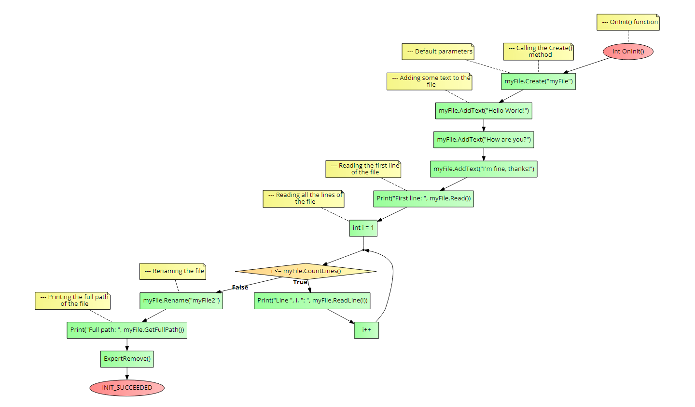

# CTextFile class
This class will help you handle files, it is a most avanced version of the built-in `CFile` class.

### Table of Contents
- [CTextFile class](#ctextfile-class)
    - [Table of Contents](#table-of-contents)
- [Installation](#installation)
- [Usage](#usage)
  - [AddText()](#addtext)
  - [Read()](#read)
  - [ReadLine()](#readline)
  - [CountLines()](#countlines)
  - [DeleteLine()](#deleteline)
  - [GetLinePosition()](#getlineposition)
    - [Notes](#notes)
  - [Rename()](#rename)
  - [Move()](#move)
    - [Notes](#notes-1)
  - [Delete()](#delete)
  - [ReadToArray()](#readtoarray)
  - [Getters](#getters)
- [Example](#example)
- [Errors](#errors)

# Installation
1. **You need to call the framework in the beginning of your script, see the main [README](../README.md) file for more information.**
2. You must make a new `CTextFile` class object.
3. You must call the `Create()` method of the class object.

```cpp
//--- Creating a new class object
CTextFile myFile;

//--- Calling the Create() method
myFile.Create(
              string name, //The name of the file
              string path = NULL, //The path or folder, must end with a backslash
              bool commonFlag = false, //If true, the file will be created in the common folder
              string extension = ".txt" //The extension of the file
              );
```

# Usage
## AddText()
It adds a new text line at the end of the file.

```cpp
AddText(string text);
```

**Return value:** `bool` - `true` if the text was added, `false` if there was an error.

## Read()
It reads the first line of the file.

```cpp
Read();
```

**Return value:** `string` - The first line of the file.

## ReadLine()
It reads a specific line of the file.

```cpp
ReadLine(int line); //Line number, starting from 1 to CountLines()
```

**Return value:** `string` - The line of the file.

## CountLines()
It returns the number of lines of the file.

```cpp
CountLines();
```

**Return value:** `int` - The number of lines of the file.

## DeleteLine()
It deletes a specific line of the file.

```cpp
DeleteLine(int line); //Line number, starting from 1 to CountLines()
```

**Return value:** `bool` - `true` if the line was deleted, `false` if there was an error.

## GetLinePosition()
It returns the position of a specific line of the file based on a given string.

```cpp
GetLinePosition(string textToFind);
```

**Return value:** `int` - The line number of the file.

### Notes
It will return the position of the first line found.

Ex: <br>
1: Hello <br>
2: World <br>
3: How are you? <br>
4: World <br>

If yoou call the function with `World` as parameter, it will return `2` <br>
In a future will be implemented an update to received all the lines in an array.

## Rename()
It renames the file.

```cpp
Rename(string newName);
```

**Return value:** `bool` - `true` if the file was renamed, `false` if there was an error.

## Move()
It moves the file to another folder.

```cpp
Move(string newPath             //The new path or folder, must end with a backslash
     bool deleteFolder = false //If true, the folder will be deleted
     );
```

**Return value:** `bool` - `true` if the file was moved, `false` if there was an error.

### Notes
It will keep the file name in the new folder, only the path will be changed. <br>
If you want to change the name of the file, you must call the `Rename()` method.

## Delete()
It deletes the file.

```cpp
Delete();
```

**Return value:** `bool` - `true` if the file was deleted, `false` if there was an error.

## ReadToArray()
It reads the file completely and returns the lines in an array. One line per position.

```cpp
ReadToArray(string &resArray[]); //The array where the lines will be stored
```

**Return value:** `void`.

## Getters
- `GetFileName()` - Returns the name of the file. Ex: `myFile.txt`
- `GetFilePath()` - Returns the path of the file. Ex: `MyFolder/`
- `GetFileExtension()` - Returns the extension of the file. Ex: `.txt`
- `GetFullPath()` - Returns the full path of the file. Ex: `MyFolder/myFile.txt`
- `IsCommon()` - Returns `true` if the file is in the common folder, `false` if it is in the script folder.

# Example
The following code is an example of how to use the `CTextFile` class. It will do the following actions:
1. It will make a new class object.
2. It will create a file in the regular folder with the name `myFile.txt`, and the initial text `Hello World!`.
3. It will add some lines to the file.
4. It will read the first line of the file.
5. It will read and print all the lines of the file.
6. It will rename the file to `myFile2.txt`.
7. It will print the full path of the file.

```cpp
//+------------------------------------------------------------------+
//| Example program for the CTextFile class                          |
//+------------------------------------------------------------------+
//--- Importing the framework
#include <Just_MQL_Framework/main.mqh>

//--- Creating a new class object
CTextFile myFile;

//--- OnInit() function
int OnInit()
  {
//--- Calling the Create() method
   myFile.Create("myFile"); //--- Default parameters

//--- Adding some text to the file
    myFile.AddText("Hello World!");
    myFile.AddText("How are you?");
    myFile.AddText("I'm fine, thanks!");

//--- Reading the first line of the file
    Print("First line: ", myFile.Read());

//--- Reading all the lines of the file
    for(int i = 1; i <= myFile.CountLines(); i++)
      {
       Print("Line ", i, ": ", myFile.ReadLine(i));
      }

//--- Renaming the file
    myFile.Rename("myFile2");

//--- Printing the full path of the file
    Print("Full path: ", myFile.GetFullPath());

    ExpertRemove();
    return(INIT_SUCCEEDED);
  }
```

Check the flow-chart below to see a compact and visual undertanding on how to call the class methods:



# Errors
- `ERR_FILE_OPEN` - Error opening the file.
- `ERR_WRONG_PARAMETERS` - The parameters given to the class methods are wrong. Check the parameters given to the class methods.