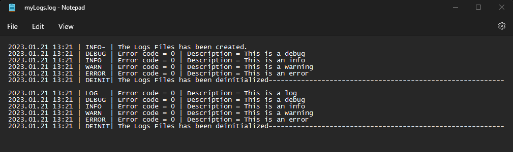
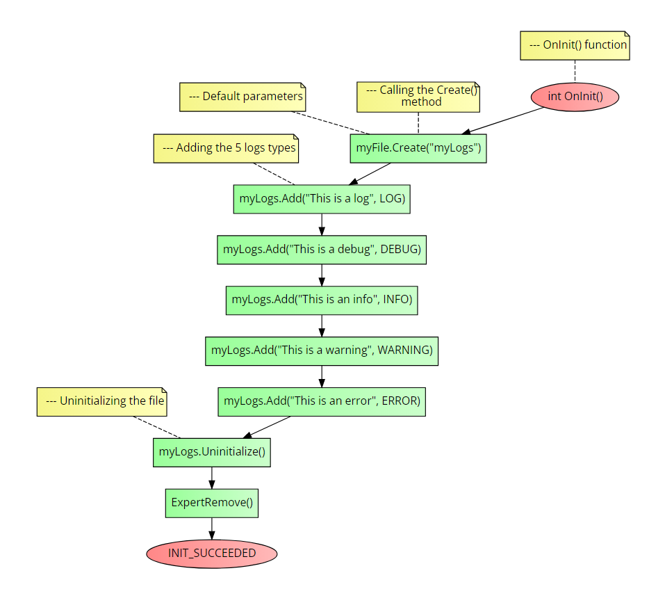

# CLogs class
This class will help you handle logs files.

### Table of Contents
- [CLogs class](#clogs-class)
    - [Table of Contents](#table-of-contents)
- [Installation](#installation)
- [Usage](#usage)
  - [Initialize()](#initialize)
  - [Add()](#add)
  - [Uninitialize()](#uninitialize)
- [Example](#example)
- [Errors](#errors)

# Installation
1. **You need to call the framework in the beginning of your script, see the main [README](../README.md) file for more information.**
2. You must make a new `CLogs` class object.
3. You must call the `Create()` method of the class object.

```cpp
//--- Creating a new class object
CTextFile myFile;

//--- Calling the Create() method
myFile.Create(
              string name,              //The name of the file
              string path = NULL,       //The path or folder, must end with a backslash
              bool commonFlag = false   //If true, the file will be created in the common folder
              );
```

# Usage
## Initialize()
It initializes the logs file. It adds the header dividing.

```cpp
Initialize();
```

**Return value:** `void`.

## Add()
It adds a new log line at the end of the file.

```cpp
Add(string details,         //The details of the log
    LOG_TYPE type,          //The type of log
    int errorCode = 0);     //The error code
```

**Return value:** `void`.

**Parameters:**
- `type` - The type of log. It can be one of the following values:
  - `LOG` = 0,
  - `DEBUG` = 1
  - `INFO` = 2
  - `WARNING` = 3
  - `ERROR` = 4

## Uninitialize()
It uninitializes the logs file. It adds the footer dividing.

```cpp
Uninitialize();
```

**Return value:** `void`.

# Example
The following code is an example of how to use the `CLogs` class. It will do the following actions:
1. It will make a new class object.
2. It will create a file in the regular folder with the name `myLogs.txt`.
3. It will initialize the file.
4. It will add 5 logs with different types.
5. It will uninitialize the file.

```cpp
//+------------------------------------------------------------------+
//| Example program for the CLogs class                              |
//+------------------------------------------------------------------+
//--- Importing the framework
#include <Just_MQL_Framework/main.mqh>

//--- Creating a new class object
CLogs myLogs;

//--- OnInit() function
int OnInit()
  {
//--- Calling the Create() method
   myFile.Create("myLogs"); //--- Default parameters

//--- Initializing the file
    myLogs.Initialize();

//--- Adding the 5 logs types
    myLogs.Add("This is a log", LOG);
    myLogs.Add("This is a debug", DEBUG);
    myLogs.Add("This is an info", INFO);
    myLogs.Add("This is a warning", WARNING);
    myLogs.Add("This is an error", ERROR);

//--- Uninitializing the file
    myLogs.Unitialize();

    ExpertRemove();
    return(INIT_SUCCEEDED);
  }
```

**Results**
The following picture is the result of running the above code 2 times: <br>



Check the flow-chart below to see a compact and visual undertanding on how to call the class methods:



# Errors
- `ERR_FILE_OPEN` - Error opening the file.
