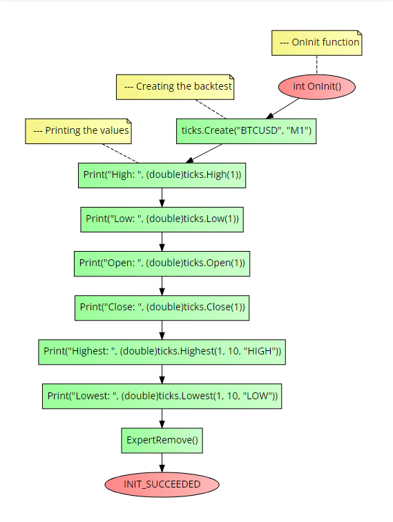

# CTicks class
This class will return all the important ticks/candle values based on a given symbol and timeframe <br>

### Table of Contents
- [CTicks class](#cticks-class)
    - [Table of Contents](#table-of-contents)
- [Installation](#installation)
    - [Notes](#notes)
- [Usage](#usage)
  - [High()](#high)
  - [Low()](#low)
  - [Open()](#open)
  - [Close()](#close)
  - [Highest()](#highest)
  - [Lowest()](#lowest)
  - [Getters](#getters)
  - [Timeframes string](#timeframes-string)
  - [Mode string](#mode-string)
- [Example](#example)
- [Errors](#errors)


# Installation
1. **You need to call the framework in the beginning of your script, see the main [README](../README.md) file for more information.**
2. Make a new `class object` of the `CTicks` class or use the pre-defined `Ticks` object using the following code:

```cpp
// For the pre-defined object
Ticks.Create(string symbol,                     //The name of the backtest
                string timeframe                //The timeframe in string
                );

// For a new class object
CTicks ticks;

ticks.Create(string symbol,                     //The name of the backtest
                string timeframe                //The timeframe in string
                );
```

**Parameters:**
- `timeframe` - The timeframe in string, see the [Timeframes string](#timeframes-string) section for more information.

**return value:** `bool` - `true` if the backtest was created successfully, `false` if it failed.

### Notes
Do not use the `Ticks` object if you are using a new `CTicks` class object, and vice versa.

# Usage
## High()
This method returns the high of a given position of the candle.

```cpp
High(int pos);          //Return the high of a given position
```

**Return value:** `double` - Returns the high of a given position.

## Low()
This method returns the high of a given position of the candle.

```cpp
Low(int pos);           //Return the low of a given position
```

**Return value:** `double` - Returns the low of a given position.

## Open()
This method returns the open of a given position of the candle.

```cpp
Open(int pos);          //Return the high of a given position
```

**Return value:** `double` - Returns the open of a given position.

## Close()
This method returns the close of a given position of the candle.

```cpp
Close(int pos);           //Return the close of a given position
```

**Return value:** `double` - Returns the close of a given position.

## Highest()
This method returns the position of the highest value of a given argument.


```cpp
Highest(int fromPos,        //The position to start from
        int toPos,          //The position to end at
        string mode        //The argument to check, can be "HIGH", "LOW", "OPEN", "CLOSE"
        );
```

**Parameters:**
- `mode` - See the [Mode string](#mode-string) section for more information.


**Return value:** `int` - Returns the position of the highest value of a given argument.

## Lowest()
This method returns the position of the lowest value of a given argument.


```cpp
Lowest(int fromPos,        //The position to start from
        int toPos,          //The position to end at
        string mode        //The argument to check, can be "HIGH", "LOW", "OPEN", "CLOSE"
        );
```

**Parameters:**
- `mode` - See the [Mode string](#mode-string) section for more information.

**Return value:** `int` - Returns the position of the lowest value of a given argument.

## Getters
- `GetSymbol()` - Returns the symbol given by the custom constructor.
- `GetTimeFrame()` - Returns the timeframe given by the custom constructor.

## Timeframes string
The following timeframes are supported:
- `CURRENT` - The current timeframe
- `M1`  - 1 minute
- `M5`  - 5 minutes
- `M10` - 10 minutes
- `M15` - 15 minutes
- `M30` - 30 minutes
- `H1`  - 1 hour
- `H4`  - 4 hours
- `D1`  - 1 day
- `W1`  - 1 week

## Mode string
The following modes are supported:
- `HIGH`    - The high value of the candle
- `LOW`     - The low value of the candle
- `OPEN`    - The open value of the candle
- `CLOSE`   - The close value of the candle

# Example
The following code is an example of how to use the `CTicks` class. It will do the following actions:
1. Create a new backtest and initialize it using a new `CTicks` class object.
2. Will print the high, low, open, close, highest and lowest values of the candle at position 0.

```cpp
//+------------------------------------------------------------------+
//| Example program for the CTicks class                             |
//+------------------------------------------------------------------+
//--- Importing the framework
#include <Just_MQL_Framework/main.mqh>

//--- Creating a new class object
CTicks ticks;

//--- OnInit function
int OnInit()
{
    //--- Creating the backtest
    ticks.Create("BTCUSD", "M1");

    //--- Printing the values
    Print("High: ", (double)ticks.High(1));
    Print("Low: ", (double)ticks.Low(1));
    Print("Open: ", (double)ticks.Open(1));
    Print("Close: ", (double)ticks.Close(1));
    Print("Highest: ", (double)ticks.Highest(1, 10, "HIGH"));
    Print("Lowest: ", (double)ticks.Lowest(1, 10, "LOW"));

    ExpertRemove();
    return(INIT_SUCCEEDED);
}
```

Check the flow-chart below to see a compact and visual undertanding on how to call the class methods:

.

# Errors
- `ERR_TICKS_CREATE` - The ticks class was not created successfully. This can be caused for an error with input parameters, try using the 'GetLastError()' function to get the error code from MetaTrader.
- `ERR_CONSTRUCTOR_NOT_CALLED` - The constructor was not called before using the class methods. Call the constructor before using the class methods.
- `ERR_WRONG_PARAMETERS` - The parameters given to the class methods are wrong. Check the parameters given to the class methods.